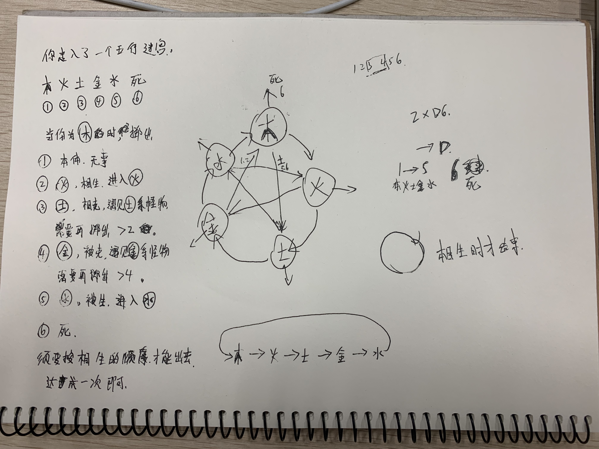

## 0x01
什么是游戏?机率与技巧组成了一个基本的游戏.

投🎲️就是纯粹的机率游戏,而纸牌就是两者相加,那么象棋就是纯粹的技巧游戏.

技巧会提高玩家的胜算,机率则增大了游戏的趣味性.

## 0x02
游戏设计需要设定很多东西,我们需要一个囊括所有的文档.

一份GDD(game design document)就是一本书:它会阐释这个游戏是怎么运行的,GDD是一个相当重要的工具.

## 0x02
玩家的反馈非常重要,可以帮助设计者明白游戏的优缺点.

否则你根本不知道玩家是不是会接受你的游戏.

而且游戏并不会一开始就是完美的,我们可以接受玩家的反馈,一步步的改进游戏.

## 0x03
作业是给一张白纸和一个2*D6的🎲️,做一个单人游戏

