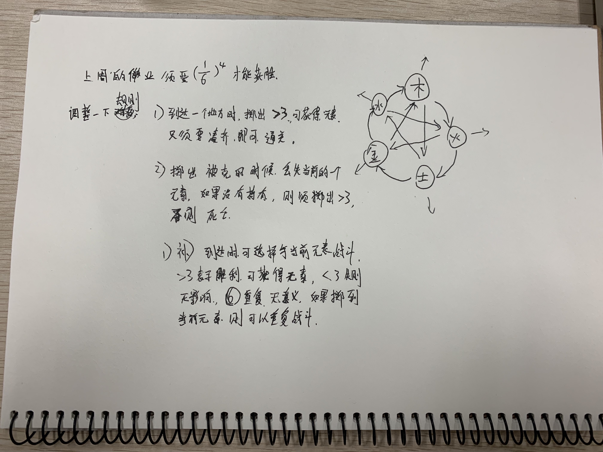

## 0x01
平衡非常重要,保持玩家处于一个思考的状态.

如果一开始玩家获得了一种非常容易通过的手段,那么游戏就毫无乐趣了.

或者玩家感到难以取胜,游戏也毫无乐趣了.

玩家变强,挑战也随之变多.做到平衡则会保持游戏富有生命力.

## 0x02
游戏规则需要非常完备,规则可以是探索式的.但是要易于理解.

但是,有时候打破规则也非常有趣:重力突然变化了<<重力幻想>>,或者转个方向,3d->2d了,吃了毒🍄️,你的控制的方向完全反了.

良好的设计会让这种规则的转变非常有趣,不好的设计则会让玩家非常反感.

规则可以通过一系列引导告诉玩家,这样更有趣.大部分玩家并没有足够的耐心仔细查看游戏规则文档.

旁白比文档好!不会打断游戏进程,比如<<堡垒>><<三位一体>>.

或者通过npc交流的模式告诉玩家,玩家会觉得在体验游戏,而不是在阅读文档.

`show is better than tell`

## 0x03

这周的作业是上周的作业的强化:思考一下游戏的规则是什么,以及怎么改变规则出现不同的玩法.

上周设计的游戏,机率占比太高,而缺少技巧,并且不够平衡,想赢得游戏,只有很小的概率.

